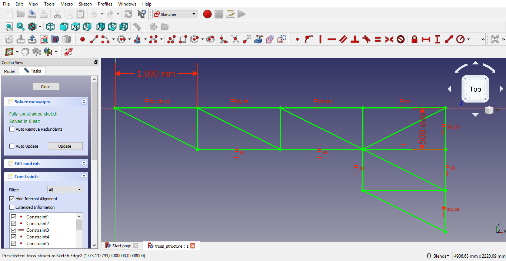
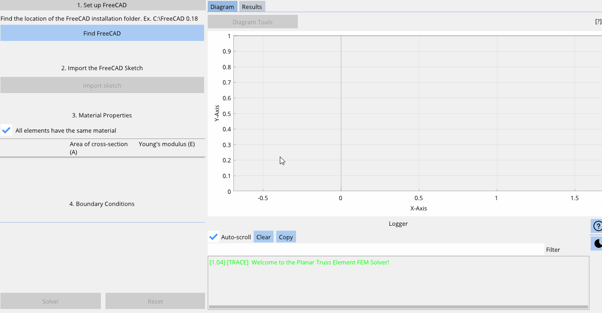
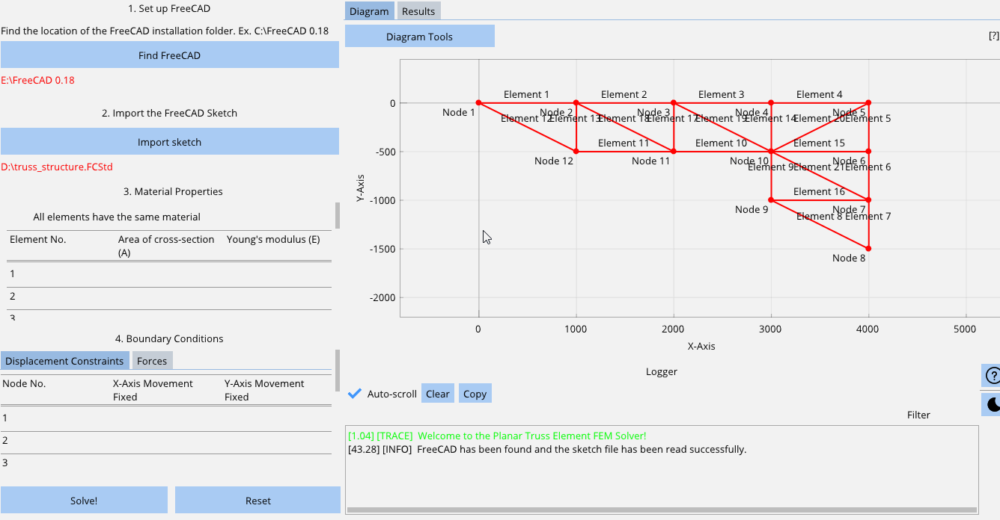
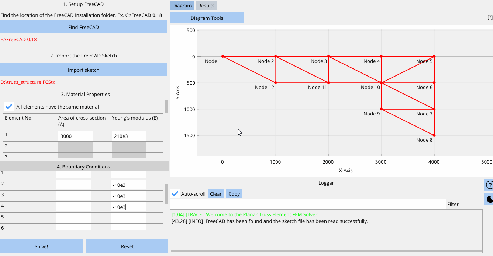
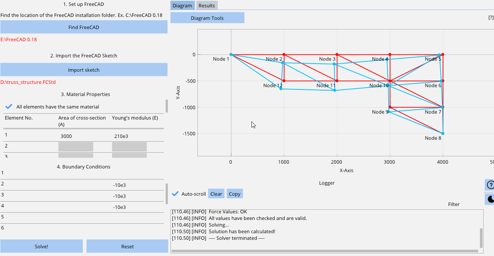

# Planar Truss Element FEM Solver


<H1>About</H1>

This solver can be used to analyse planar (2 dimensional) truss element structures made of 1D bar elements connected at various nodes that include movement constraints and 1D forces acting at the nodes. It uses the direct stiffness method and assembles the global nodal force vector, global element stiffness matrix, and the global nodal displacement vector and uses the elimination approach on the global relationship after applying all the boundary conditions provided by the user to solve for the unknown nodal displacements.

Values calculated:
1. Nodal displacements
2. Nodal reaction forces at supports
3. Element stress
4. Element strain

Features included:
1. Import any truss structure sketch from FreeCAD
2. Visualize the original sketch
3. Control material properties of individual elements
4. Control support reactions in the X or Y axis for individual nodes
5. Control forces in the X or Y axis for individual nodes
6. Visualize the deformed structure
7. Control the amplification scale of the deformed structure
8. Show/Hide the node and element numbers, original sketch, and deformed sketch
9. Analyse all the results calculated for each element and node
10. Dark mode

<i><b>Points to note:

1. All forces acting downwards are negative and all forces acting upwards are positive.
2. The user has to make sure the values entered have the correct units. The software does not convert any values entered. Results are obtained based on the values that are entered without converting them to different units. In the following example, the displacements are in mm, reaction forces are in Newton, and stresses are in MPa.</b></i>


<H1>Instructions</H1>

1. Make sure you have <b>Python 3.6*</b> installed and working, preferably in a virtual environment.
   
2. Clone the repository:

```git clone https://github.com/RahulShagri/Planar-Truss-Element-FEM-Solver.git```

3. Install prerequisites using pip, preferably in a new environment:

```pip install -r requirements.txt``` 

4. Run the <i>Planar_Truss_Element_Solver.py</i> file.

<b>Note: *FreeCAD cannot be imported on newer Python versions.</b>


<H2>Example Problem</H2>

<H3>Step 1: Sketching the structure in FreeCAD</H3>

Create a sketch on the <b>XY Plane</b> on FreeCAD and ensure all the elements and nodes are connected, and the sketch is fully constrained (i.e. it is completely green).



<H3>Step 2: Setting up FreeCAD and importing the sketch</H3>

Open the Planar Truss Element FEM Solver and locate the FreeCAD installation folder and import the FreeCAD Sketch.



<H3>Step 3: Assigning materials, displacement constraints, and nodal forces</H3>

- Select "All materials have the same materials" when all links are made of the same Area of Cross-Section and have the same Young's Modulus.
- Then enter the values of the material properties.
- Select the appropriate displacement constraint for each node. (Selecting the checkbox means fixing the respective node in the respective axis and leaving it deselected means it is free to move in that direction.)
- Enter all the nodal force values. (All forces acting in the positive Y-Axis and positive X-Axis are positive and all the forces acting in the negative Y-Axis and the negative X-Axis are negative.)
- <b><i>Note: All units are in SI units in this example.</i></b>



<H3>Step 4: Solving the problem and ensuring there are no errors</H3>

- Hit the solve button to calculate a solution.
- View the Log Window on the bottom-right corner to make sure no error were found and a solution has been calculated.




<H3>Step 5: Visualising the deformed structure and analysing the results</H3>

- Click on "Diagram Tools" to bring up the diagram settings where you can show or hide the element numbers, node numbers, original structure, and deformed structure and set the amplification scale of the deformed structure too.
- Switch to the results tab to view all the calculated values.



<H2>Contact</H2>

You can contact me using the messaging form or the emailing option on my [engineering portfolio website](https://rahulshagri.github.io/).
